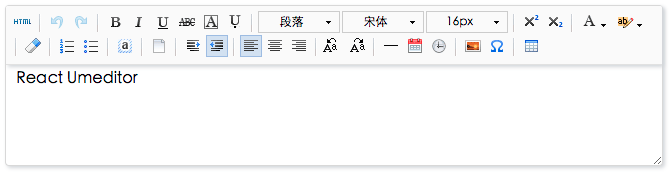

# react-umeditor

[](https://www.npmjs.com/package/react-umeditor)
[](https://www.npmjs.com/package/react-umeditor)

React Editor like [Umeditor](https://github.com/fex-team/umeditor)

## Install 

	npm install react-umeditor --save

## Use

javascript

``` js
var React = require('react');
var Editor = require('react-umeditor');

class App extends React.Component {
	constructor(props){
		super(props);
		this.state = {
			content: ""
		}
	}
	handleChange(content){
		this.setState({
			content: content
		})
	}
	getIcons(){
		var icons = [
			"source | undo redo | bold italic underline strikethrough fontborder emphasis | ",
			"paragraph fontfamily fontsize | superscript subscript | ",
			"forecolor backcolor | removeformat | insertorderedlist insertunorderedlist | selectall | ",
			"cleardoc  | indent outdent | justifyleft justifycenter justifyright | touppercase tolowercase | ",
			"horizontal date time  | image emotion spechars | inserttable"
		]
		return icons;
	}
	getPlugins(){
		return {
			"image": { 
				"uploader": { 
					"name":"file", 
					"url": "/api/upload" 
				} 
			} 
		}
	}
	render(){
	    var icons = this.getIcons();
		var plugins = this.getPlugins();
		return (<Editor ref="editor" 
			icons={icons} 
			value={this.state.content} defaultValue="<p>React Umeditor</p>" 
			onChange={this.handleChange.bind(this)} 
			plugins={plugins} />)
	}
}
```
	
html

``` html
<!DOCTYPE html>
<html lang="en">
<head>
	<meta charset="UTF-8">
	<title>Editor Demo</title>
	
	<!-- mathquill & umeditor stylesheet & if you have the formula icon -->
	<link rel="stylesheet" href="../../dist/third-part/mathquill/mathquill.css"/>
	
	<link rel="stylesheet" href="app.css" type="text/css" />
</head>
<body>
	<div id="react-container"></div>
	
	<!-- jquery & mathquill javascript & if you have the formula icon -->
	<script src="../../dist/third-part/jquery.min.js"></script>
	<script src="../../dist/third-part/mathquill/mathquill.js"></script>
	
	<!-- your react script -->
	<script src="bundle.js"></script>
	<script src="app.js"></script>
</body>
</html>
```
	
## Example

- [react-umeditor-example](https://github.com/liuhong1happy/react-umeditor-example)

## Ref Functions

You can `this.refs.editor.xxx()`! The `xxx` maybe is as follows:

* findDOMNode: find  refs by ref name  `"root","editarea","toolbar","color" `
* setContent: set html of editor
* getContent: get html of editor
* focusEditor: focus the editor

## Props

You can set the `props`!The `props` maybe is as follows:
* onFocus: the focus event
* onChange: the text change event `{ content: string }`
* defaultValue: default value of editor
* value: value of editor
* icons: icons of toolbar
* plugins: settings of plugins
	* toolbar: settings of toolbar
		* icons: custom icons
			* name: name of icon
			* onIconClick: handle event
			* mapRangeState: filter rangeState
			* props: props of icon & component
			* component: custom component, eg. dialog
	* image: settings of image dialog 
		* uploader: settings of image uploader
			* name:  form name of xhr
			* url:  url of server
			* data: other formData of xhr
			* filter: filter json style body
		* customUploader: custom file uploader(see [FileUploader](./src/utils/FileUpload.js))

## Icons

Support icons, As fllow:

	source undo redo bold italic underline strikethrough fontborder emphasis 
	paragraph fontfamily fontsize superscript subscript 
	forecolor backcolor removeformat insertorderedlist insertunorderedlist  selectall 
	cleardoc  indent outdent justifyleft justifycenter justifyright  touppercase tolowercase 
	horizontal date time  image emotion spechars inserttable formula

## Snapshot



## Develop

	// clone code
	git clone https://github.com/liuhong1happy/react-umeditor
	cd react-umeditor
	// install require
	npm install
	// build
	npm run build
	// run example server
	cd example
	npm run example
	
## Todo - Version 1.0

- [x] 1. Custom Image Uploader Props
- [x] 2. Custom Toolbar Icon
- [x] 3. ES6 Style
- [x] 4. React16
- [ ] 5. Tests (Toolbar & Example & New Feature)
- [ ] 6. Docs (README.md & Docs & Example Docs)

## Contribute

Changes and improvements are more than welcome! Feel free to fork and open a pull request. Please make your changes in a specific branch and request to pull into master! If you can, please make sure the editor fully works before sending the PR, as that will help speed up the process.

See more [document](https://github.com/liuhong1happy/react-umeditor/blob/master/docs/contribute.md)

## Concat

Email: [liuhong1.happy@163.com](mailto:liuhong1.happy@163.com)

QQ Group: 247978846
