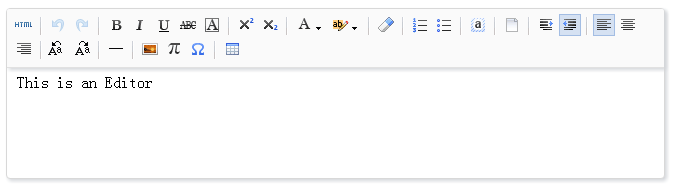

# react-umeditor

React Editor like [Umeditor](https://github.com/fex-team/umeditor)

## Install 

	npm install -g react-umeditor

## Use

	var React = require('react');
	var Editor = require('react-umeditor');

	var App = React.createClass({
		render:function(){
			return (<Editor ref="editor"/>)
		}
	})
	
## Ref Functions

You can `this.refs.editor.xxx()`! The `xxx` maybe is as follows:

* findDOMNode: find  refs by ref name  `"root","editarea","toolbar","color" `
* setContent: set html of editor
* getContent: get html of editor
* onFocus: the focus event
* focusEditor: focus the editor
* defaultValue: default value of editor
* value: value of editor
* icons: icons of toolbar
* plugins: settings of plugins
		* image: settings of image dialog 
				* uploader: settings of image uploader
						* name:  form name of xhr
						* url:  url of server

## Snapshot

## Develop

	git clone https://github.com/liuhong1happy/react-umeditor
	cd react-umeditor
	npm install
	npm run build

open the file `example/dist/index.html`